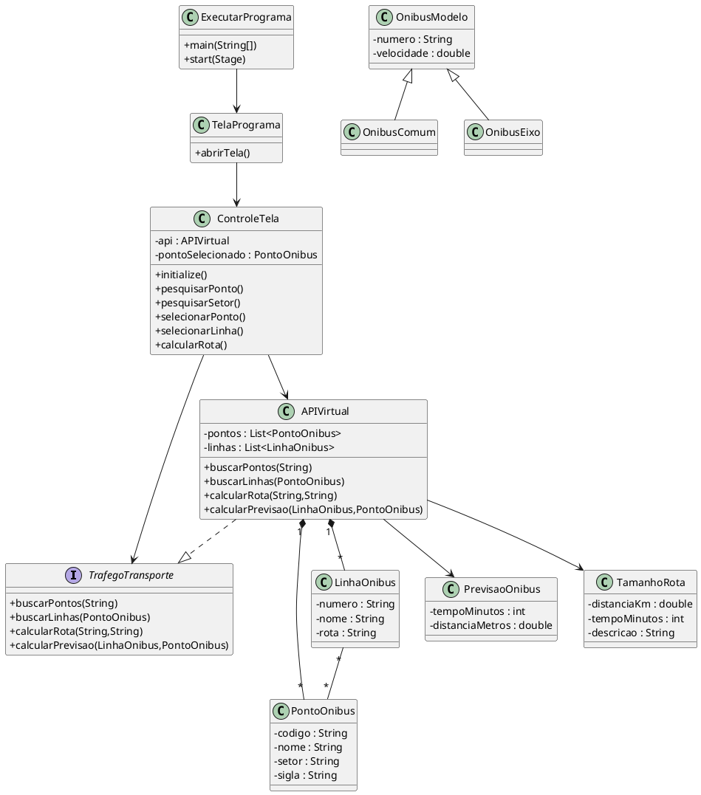
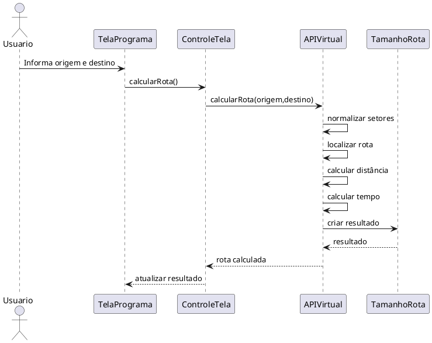
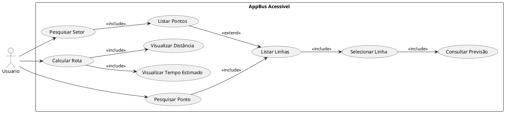
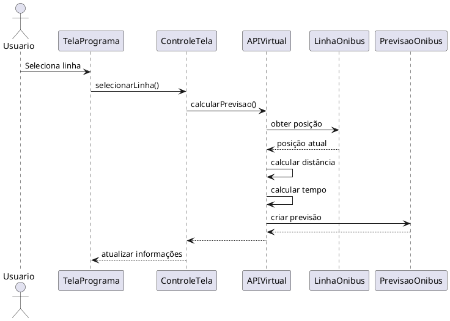
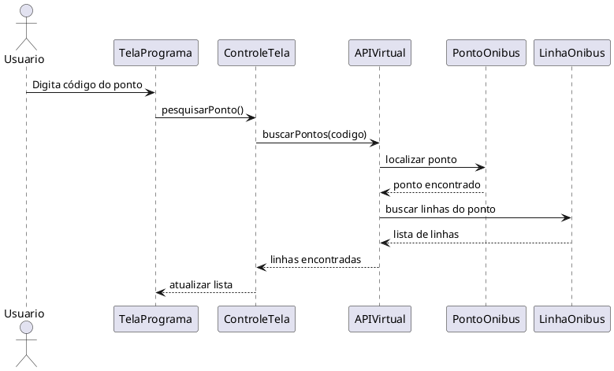
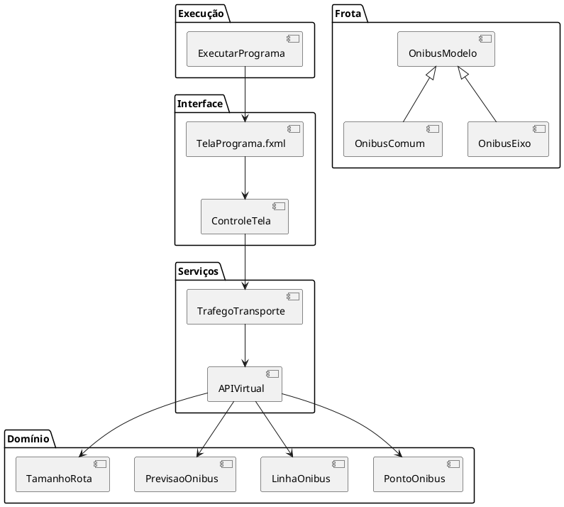

# UML e Evidências/Testes de Execução - AppBus Acessível

## Diagrama de Classes

---

## Diagrama de Sequência - Calculo de Rota

---

## Diagrama de Casos de Uso

---

## Diagrama de Sequência - Previsão de Chegada

---

## Diagrama de Sequência - Pesquisa de Ponto

---

## Diagrama dos Componentes do Programa

---

# Evidências de Execução e Testes

## Capturas de Tela

### Figura 1

### Figura 2

### Figura 3

### Figura 4

### Figura 5

### Figura 6

### Figura 7

### Figura 8

### Figura 9

### Figura 10

### Figura 11

### Figura 12

### Figura 13

### Figura 14

### Figura 15

### Figura 16

### Figura 17

### Figura 18

### Figura 19

### Figura 20

### Figura 21

### Figura 22

### Figura 23

### Figura 24

### Figura 25

### Figura 26

## Observações dos Testes

As imagens apresentadas demonstram:

- Execução da interface gráfica JavaFX;
- Consulta de pontos de ônibus;
- Exibição de linhas associadas aos pontos;
- Cálculo de rotas entre setores;
- Simulação de previsão de chegada;
- Validação das funcionalidades principais do sistema.
